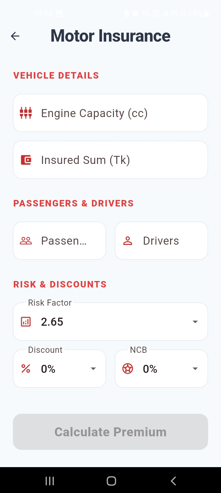
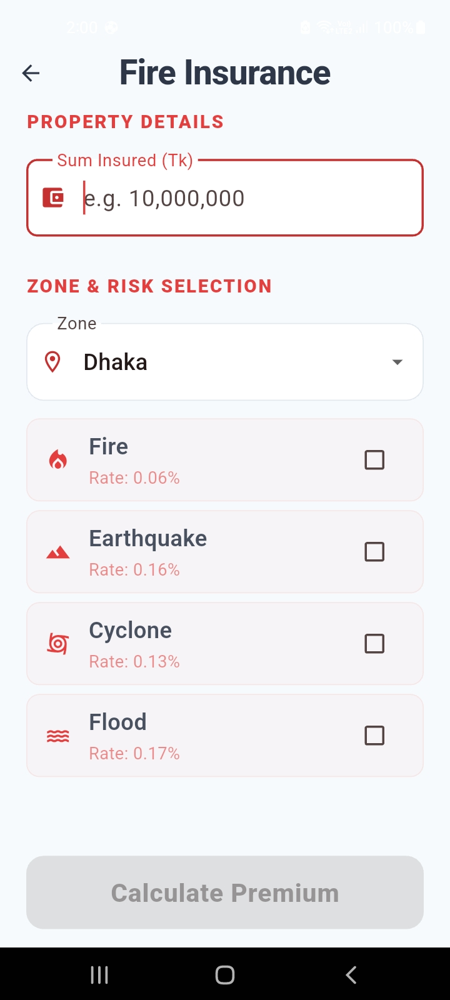
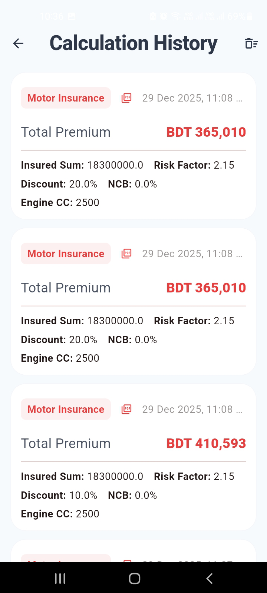

# 🚗 Quick Insure

**Quick Insure** is a modern, Android **Flutter insurance calculator app** designed to help users accurately calculate insurance premiums with a clean UI, smooth animations, and offline-first performance.

The app currently supports **Motor Insurance** and **Fire Insurance**

---

## 📸 Screenshots

| Home (Light Mode)               | Home (Dark Mode)               |
| ------------------------------- | ------------------------------ |
|  |  |

| Motor Insurance Calculator      | Fire Insurance Calculator        | Calculation History          |
| ------------------------------- | ------------------------------- | ---------------------------- |
|  |  |  |

---

## 🚀 Download

**Latest Release (v2.1.1)**  
👉 [Download APK](https://github.com/DevCat-exe/Quick-Insure/releases/download/v2.1.1/quickinsure_2.1.1.apk)

---

## ✨ Features

- 🚘 **Motor Insurance Calculator**  
  Calculate premiums with accurate breakdowns and instant results

- 🔥 **Fire Insurance Calculator**  
  Zone-based property insurance with multiple risk options (Fire, Earthquake, Cyclone, Flood)
  and individual premium breakdowns

- 📜 **Calculation History**  
  Automatically saves previous calculations for quick reference

- 🌗 **Light & Dark Mode**  
  Seamless theme switching with a polished UI

- 🎯 **Clean UX**  
  Minimal design, smooth transitions, and intuitive navigation

---

## 🛠️ Tech Stack

| Category  | Technologies                               |
| --------- | ------------------------------------------ |
| Framework | Flutter                                    |
| Language  | Dart                                       |
| UI        | Material Design, Custom Animations         |
| State     | Local state management                     |
| Platform  | Android (APK), extensible to iOS & Desktop |

## 📦 Getting Started

```bash
# Clone the repository
git clone https://github.com/DevCat-exe/Quick-Insure.git

# Install dependencies
flutter pub get

# Run the app
flutter run
```

**Prerequisites**

- Flutter SDK (stable)
- Android Studio or VS Code
- Android emulator or physical device

---

## 🚧 Planned Features

- 🏥 Health Insurance Calculator